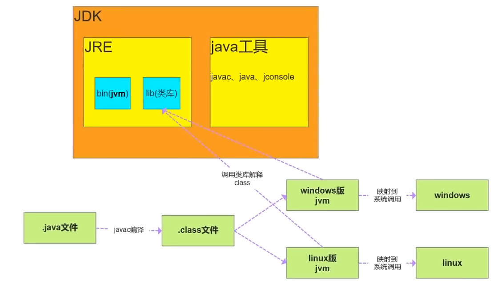

# JDK、JRE、JVM
## JDK
### Java Development Kit Java开发工具
jdk是为java程序开发人员准备的。
## JRE
### Java Runtime Environment Java运行时环境
jre是java程序运行所需环境
## JVM
Java Virtual Machine Java虚拟机
jvm虚拟机将编译好的.class文件解释为机器码

### 一次编译，到处执行 -> 不同平台有其对应的jvm

