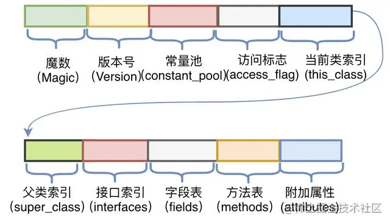

# 什么是字节码，有什么好处？

## 什么是字节码？
字节码Java的编译器将编写的程序编译生成的二进制文件，也就是.class文件，字节码不面向系统，只面向虚拟机。字节码会交给虚拟机，虚拟机交给解释器将字节码解释为特点平台的机器码，
每一种平台的解释器不同，但实现的虚拟机相同。

## 好处
1. 效率比解释型语言高
2. 可移植性，一次编译到处运行。

## 一些补充
Java字节码文件（.class）:对Java源文件（.java）编译后生成的二进制文件。二进制文件不单单包含只由0、1二进制组成的文件，还包括四、八、十六进职等。Java字节码文件是十六进制的二进制文件。
之所以被称为字节码，是因为 .class文件是由十六进制值组成的，JVM以两个十六进制值为一组，就是以字节为单位进行读取

字节码内容：

魔数

所有的.class文件的前4个字节都是魔数，魔数以一个固定值：0xCAFEBABE，放在文件的开头，JVM就可以根据这个文件的开头来判断这个文件是否可能是一个.class文件，如果是以这个开头，才会往后执行下面的操作，这个魔数的固定值是Java之父James Gosling指定的，意为CafeBabe（咖啡宝贝）

