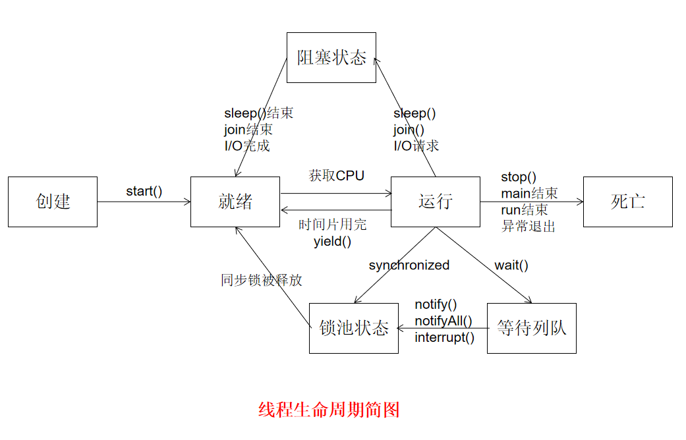

# sleep()、wait()、join()、yield()

## 锁池、等待池

Java对象中有个Java监视器的东西，是并发的控制器，但看不到Java实现，因为底层是用c++实现的，锁池和等待池都是监视器（ObjectMonitor）中的。WaitSet、EntryList、

锁池:如果线程A已经拥有了某个对象的锁，则其它线程想要调用这个对象的同步代码块时，无法获得该对象上锁的拥有权，那么这些线程就进入了该对象的锁池中。
等待池:如果线程A调用了某个对象的wait()方法，线程A就会立马释放该对象的锁，同时线程A就进入到了该对象的等待池中。WaitSet

## sleep()和wait()的区别

1. sleep()是Thread类的静态方法，wait()是Object类的本地方法，还包括notify() notifyAll()
2. sleep()不会释放锁资源，wait()会释放锁资源，并进入到等待池
3. wait()需要在synchronized关键字修饰的范围使用，而sleep()没有这个限制
4. sleep()不需要唤醒，wait()如果不指定时间，就需要唤醒
5. sleep()用于当前线程休眠，wait()用户多线程之间的通信
6. sleep()会让出cpu，并强制切换上下文， 而wait()是有可能再次竞争到锁继续执行的

## yield()
yield()执行后线程直接进入就绪状态，马上释放了cpu资源，但依旧持有竞争资格，有可能再次竞争到cpu资源。

## join()
join()执行后，线程进入阻塞状态，例如在线程B中调用线程A的join()，那线程B会进入阻塞状态，直到线程A结束或中断线程。
