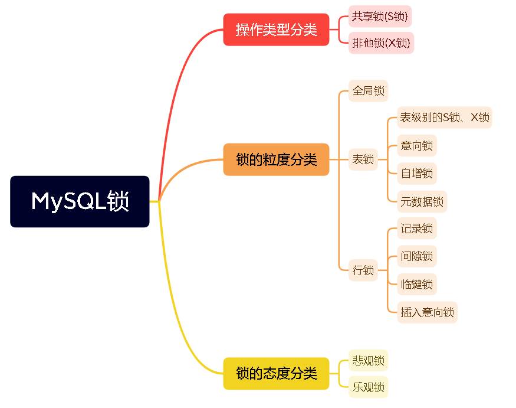

# mysql中 #和$的区别，哪个更安全
    #号会对传入的值视为字符串，也就相当于对数据加上了引号。如select * from a where name = #{name},传入a
    就变成了 select * from a where name = 'a'

    $号不会对传入的值预编译，传入啥就是啥，传入a就变成了
    select * from a where name = a

    总结：#号可以很大程序上防止sql注入，比$安全

# 缓存穿透、缓存击穿、缓存雪崩，及其解决方案
    
    缓存穿透：缓存穿透是指，数据在缓存和数据库中都不存在，每次查询都打到数据库，最后返回空。
    解决方案有两种，一种是缓存空对象，这种方案有弊端，一占空间，二会产生数据不一致问题，缓存空对象未失效期间，数据库如果有值了，就不一致了。
    第二种解决方案是引入布隆过滤器。

    缓存击穿：缓存击穿是指某条热点数据缓存过期了，在重新缓存之前，大量的查询穿过缓存，直接打到数据库上了。
    解决方案：一 设置永不过期，二 设置定时任务，定时更新缓存，三 采用分布式锁，同一时刻只能有一个请求能够去加载数据到缓存，其他请求查询时缓存中就有值了

    缓存雪崩：缓存雪崩是指大量key在同一时间过期了或者redis挂掉了，导致查询请求直接打到数据库。
    解决方案：如果是key过期了，就尽量让key分布均匀一点，如果是redis挂了，就采取高可用方案，集群方案。

# 说说对反射的理解，
    反射是在运行状态中，对于任意一个类，都能够知道这个类的所有属性和方法,对于任意一个对象，都能够调用它的任意方法和属性,这种动态获取信息以及动态调用对象方法的功能称为java语言的反射机制。
# 哪些框架应用了反射
    JDBC
    Spring
    MyBatis
    rocketMq（不算框架，中间件）
    dubbo（同上）

# IOC、AOP的理解
    IOC：控制反转，把原本应该由编程人员控制的对象创建、对象之间依赖关系等事情，交给Spring容器管理
    AOP：面向切面编程，spring支持将一些与业务无关的逻辑（如：日志管理等）抽取出来，创建切面，以切面的方式加入程序，减少此类功能对业务的侵入。
# Map的实现类 说几个，并讲下底层实现
    HashMap、ConcurrentHashMap等 + 源码分析（putValue、扩容）

# MySQL事务隔离级别（默认的事务隔离级别是 REPEATABLE READ。）
    序列化（SERIALIZABLE）：如果隔离级别为序列化，则用户之间通过一个接一个顺序地执行当前的事务，这种隔离级别提供了事务之间最大限度的隔离。

    可重复读（REPEATABLE READ）：在可重复读在这一隔离级别上，事务不会被看成是一个序列。不过，当前正在执行事务的变化仍然不能被外部看到，也就是说，如果用户在另外一个事务中执行同条 SELECT 语句数次，结果总是相同的。（因为正在执行的事务所产生的数据变化不能被外部看到）。

    提交读（READ COMMITTED）：READ COMMITTED 隔离级别的安全性比 REPEATABLE READ 隔离级别的安全性要差。处于 READ COMMITTED 级别的事务可以看到其他事务对数据的修改。也就是说，在事务处理期间，如果其他事务修改了相应的表，那么同一个事务的多个 SELECT 语句可能返回不同的结果。

    未提交读（READ UNCOMMITTED）：READ UNCOMMITTED 提供了事务之间最小限度的隔离。除了容易产生虚幻的读操作和不能重复的读操作外，处于这个隔离级的事务可以读到其他事务还没有提交的数据，如果这个事务使用其他事务不提交的变化作为计算的基础，然后那些未提交的变化被它们的父事务撤销，这就导致了大量的数据变化。

# 什么是脏读、幻读、不可重复读：
    脏读：脏读指的是读到了其他事务未提交的数据，未提交意味着这些数据可能会回滚，也就是可能最终不会存到数据库中，也就是不存在的数据。读到了不一定最终存在的数据，这就是脏读。
    
    幻读：是指在RR(可重复读隔离级别)下，事务A首先查询，未查询到数据，然后事务B插入数据并提交，事务A再次查询依旧不会查询到数据，因为是RR级别，事务B的提交对A不可见，这时事务A插入数据，会发现数据已经存在了，这就是幻读。
    
    不可重复读：不可重复读是指 在一个事务内，多次读取数据出现不一致的情况，因为这期间可能有其他事务插入数据。

# MySQL锁机制

    https://blog.csdn.net/weixin_45902285/article/details/126186759

# MyBatis的使用
    大体流程：
        1. 引入依赖
        2. 做些配置：逻辑删除字段等
        3. 配置编写代码生成器
        4. 创建表
        5. 反向生成相关代码

# tcp 三次握手
    第1次握手：客户端发送一个带有SYN（synchronize）标志的数据包给服务端；
    第2次握手：服务端接收成功后，回传一个带有SYN/ACK标志的数据包传递确认信息，表示我收到了；
    第3次握手：客户端再回传一个带有ACK标志的数据包，表示我知道了，握手结束。
    
    详细说明：
    1、客户端发送建立TCP连接的请求报文，其中报文中包含seq序列号，是由发送端随机生成的，并且将报文中的SYN字段置为1，表示需要建立TCP连接。（SYN=1，seq=x，x为随机生成数值）；
    2、服务端回复客户端发送的TCP连接请求报文，其中包含seq序列号，是由回复端随机生成的，并且将SYN置为1，而且会产生ACK字段，ACK字段数值是在客户端发送过来的序列号seq的基础上加1进行回复，以便客户端收到信息时，知晓自己的TCP建立请求已得到验证。（SYN=1，ACK=x+1，seq=y，y为随机生成数值）这里的ack加1可以理解为是确认和谁建立连接；
    3、客户端收到服务端发送的TCP建立验证请求后，会使自己的序列号加1表示，并且再次回复ACK验证请求，在服务端发过来的seq上加1进行回复。（SYN=1，ACK=y+1，seq=x+1）。

# tcp 四次挥手
    第1次挥手：客户端发送一个FIN，用来关闭客户端到服务端的数据传送，客户端进入FIN_WAIT_1状态；
    第2次挥手：服务端收到FIN后，发送一个ACK给客户端，确认序号为收到序号+1（与SYN相同，一个FIN占用一个序号），服务端进入CLOSE_WAIT状态；
    第3次挥手：服务端发送一个FIN，用来关闭服务端到客户端的数据传送，服务端进入LAST_ACK状态；
    第4次挥手：客户端收到FIN后，客户端t进入TIME_WAIT状态，接着发送一个ACK给Server，确认序号为收到序号+1，服务端进入CLOSED状态，完成四次挥手。
    
    详细说明：
    1、客户端发送断开TCP连接请求的报文，其中报文中包含seq序列号，是由发送端随机生成的，并且还将报文中的FIN字段置为1，表示需要断开TCP连接。（FIN=1，seq=x，x由客户端随机生成）；

    2、服务端会回复客户端发送的TCP断开请求报文，其包含seq序列号，是由回复端随机生成的，而且会产生ACK字段，ACK字段数值是在客户端发过来的seq序列号基础上加1进行回复，以便客户端收到信息时，知晓自己的TCP断开请求已经得到验证。（FIN=1，ACK=x+1，seq=y，y由服务端随机生成）；

    3、服务端在回复完客户端的TCP断开请求后，不会马上进行TCP连接的断开，服务端会先确保断开前，所有传输到A的数据是否已经传输完毕，一旦确认传输数据完毕，就会将回复报文的FIN字段置1，并且产生随机seq序列号。（FIN=1，ACK=x+1，seq=z，z由服务端随机生成）；

    4、客户端收到服务端的TCP断开请求后，会回复服务端的断开请求，包含随机生成的seq字段和ACK字段，ACK字段会在服务端的TCP断开请求的seq基础上加1，从而完成服务端请求的验证回复。（FIN=1，ACK=z+1，seq=h，h为客户端随机生成）
    至此TCP断开的4次挥手过程完毕。

# tcp、udp的区别
    tcp和udp都是传输层协议
    区别：
        TCP向上层提供面向连接的可靠服务 ，UDP向上层提供无连接不可靠服务。
        虽然 UDP 并没有 TCP 传输来的准确，但是也能在很多实时性要求高的地方有所作为
        对数据准确性要求高，速度可以相对较慢的，可以选用TCP

# 多线程的几种方式
    1. 继承Thread类
    2. 实现Runnable接口
    3. 使用Callable和FutureTask实现有返回值的多线程
    4. 使用ExcutorService和Excutors工具类实现线程池

# 线程池有几种
    FixedThreadPool：
        核心线程数 == 最大线程数（没有救急线程），自然也无需超时时间
        阻塞队列是无界的，可以放任意数量的任务
        适用于任务量已知，相对耗时的任务
    CachedTreadPool：
        核心线程数是0，最大线程数是Integer.MAX_VALUE，救急线程的空闲时间为60s，意味着：
        全部都是救急线程（60s后回收）
        救急线程可以无限创建
    ScheduledThreadPool：
        支持定时及周期性任务执行
    SingleThreadExecutor：
        线程数始终为1，不能修改。希望多个任务排队执行。任务数多于 1 时，会放入无界队列排队。 任务执行完毕，这唯一的线程也不会被释放

# 线程池的作用
    1. 线程池里的线程可以复用，节省系统开销
    2. 线程池方便管理线程
# 线程池的几个重要参数
    1. corePoolSize 线程池核心线程数
    2. maximumPoolSize 线程池最大线程数
    3. keepAliveTime 空闲线程存活时间
    4. unit 空闲线程存活时间单位
    5. workQueue 工作队列
    6. threadFactory 线程工厂
    7. handler 拒绝策略

# 说说你了解哪些排序算法（具体实现）
    选择排序、快速排序、插入排序、冒泡排序、归并排序、堆排序
    冒泡排序：
        每次比较相邻的两个数，如果前边的比后边的大，就交换位置。
    选择排序：
        每次找到最小的数，放在最前面，下一次就在剩余的数里面找最小的，放到后面。
    插入排序：
        把数组分为有序区和无序区，每次从无序区取一个，放到有序区的对应位置，
    快速排序：
        归位+递归
        取第一个数，然后分别从数组两端遍历，从左边找比当前数大的，从右边找比当前数小的，直到遍历的下标相遇，这是一次，然后递归执行。
    堆排序：
        建立堆，
        得到堆顶元素，是最大元素，
        去掉堆顶，将堆最后一个元素放在堆顶，通过一次调整使之有序，堆顶元素为第二大元素
        重复上一步，直到堆变空
    归并排序：
        分解：将列表越分越小，直至分成一个元素
        终止条件：一个元素是有序的   
        合并：将两个有序列表归并，列表越来越大
    

# Redis的集群有哪几种：
    主从、哨兵

# Redis的数据格式有哪些(扩展 mongodb数据类型)
    String
    Hash
    Set
    ZSet
    List

# Mongodb数据类型（上个问题扩展的）
    数据类型	描述
    String	字符串。存储数据常用的数据类型。在 MongoDB 中，UTF-8 编码的字符串才是合法的。
    Integer	整型数值。用于存储数值。根据你所采用的服务器，可分为 32 位或 64 位。
    Boolean	布尔值。用于存储布尔值（真/假）。
    Double	双精度浮点值。用于存储浮点值。
    Min/Max keys	将一个值与 BSON（二进制的 JSON）元素的最低值和最高值相对比。
    Array	用于将数组或列表或多个值存储为一个键。
    Timestamp	时间戳。记录文档修改或添加的具体时间。
    Object	用于内嵌文档。
    Null	用于创建空值。
    Symbol	符号。该数据类型基本上等同于字符串类型，但不同的是，它一般用于采用特殊符号类型的语言。
    Date	日期时间。用 UNIX 时间格式来存储当前日期或时间。你可以指定自己的日期时间：创建 Date 对象，传入年月日信息。
    Object ID	对象 ID。用于创建文档的 ID。　　(每个文档都有)
    Binary Data	二进制数据。用于存储二进制数据。
    Code	代码类型。用于在文档中存储 JavaScript 代码。
    Regular expression	正则表达式

# MySQL的分页怎么实现
    利用limit实现分页，语法为“SELECT*FROM 表名 limit 开始记录数,每页条数”；
    利用主键索引实现分页，语法为“SELECT*FROM 表名 WHERE 字段名 > (页数*10) LIMIT 条数”

# 数据库三大范式
    第一范式（1NF）：所有字段都是不可分解的原子值，就满足第一范式
    第二范式（2NF）：在第一范式的基础上，所有字段都要与主键相关，不能仅与部分主键有关（针对联合主键）。
    第三范式（3NF）：在第二范式的基础上，所有字段都要与主键直接相关。

# AIO、BIO、NIO
    BIO：同步阻塞，用户发起IO请求后，需要等待IO操作结束，才能继续下一步
    NIO：同步非阻塞，用户发起IO请求后，不需要等待IO操作结束，可以执行其他操作，但要不断询问IO操作是否执行结束。
    AIO：异步非阻塞，用户发起IO请求后，不需要等待IO操作，也不需询问，继续执行其他操作，IO操作结束后会通知，这时再继续执行后续操作。
# 常见的NIO框架  netty等
    https://blog.csdn.net/Squid87/article/details/124917512
    https://blog.csdn.net/weixin_35821291/article/details/123709805
    